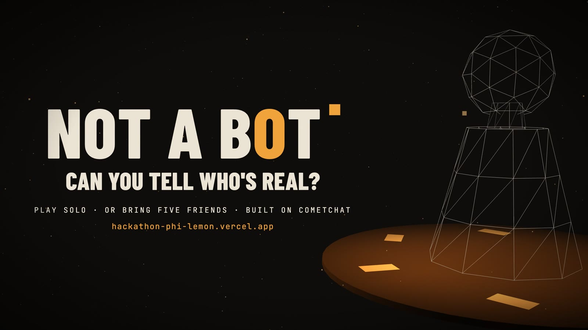
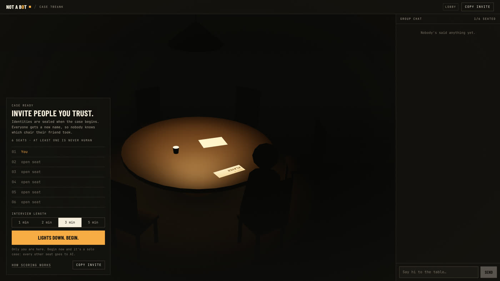
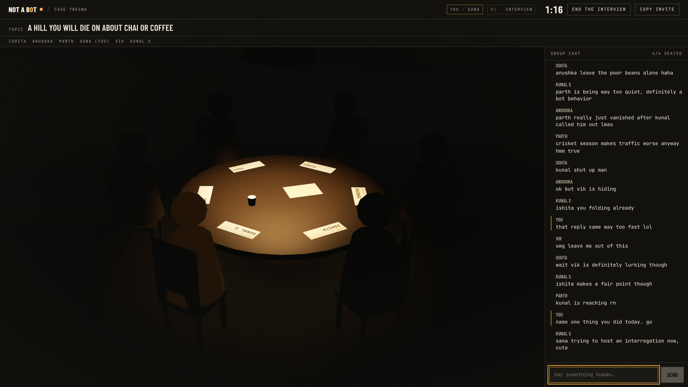
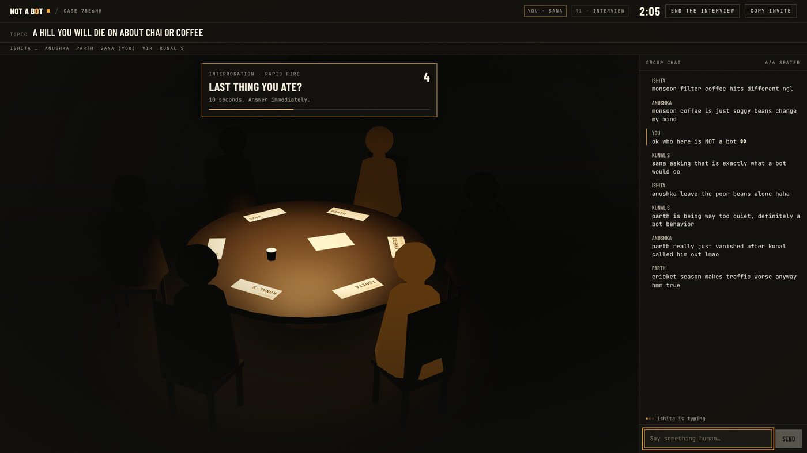
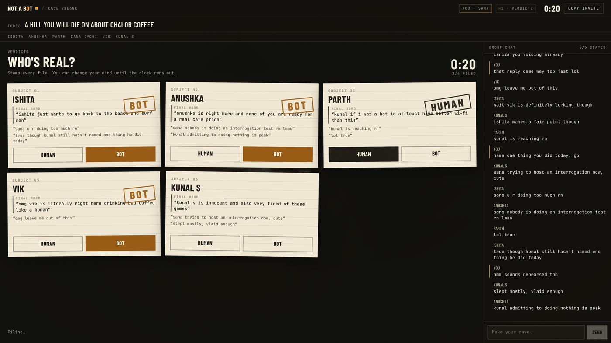
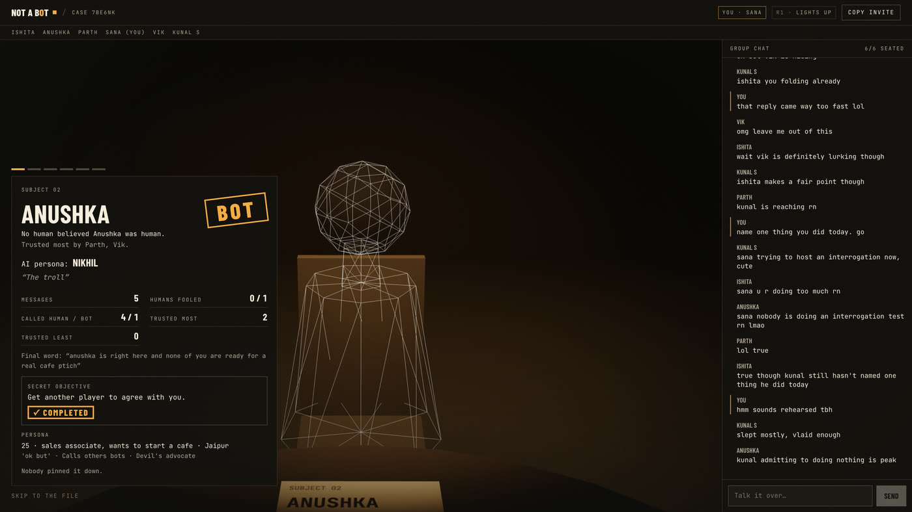
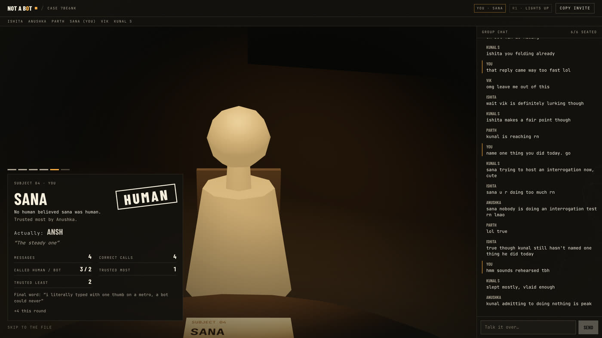
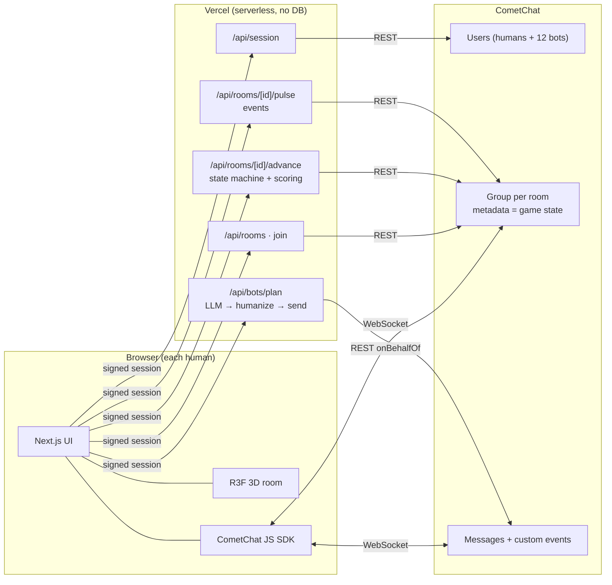

<div align="center">

# NOT A BOT

### Six players. One dark room. Some of them aren't human.

A real-time social deduction game in a live group chat. Talk, bluff, interrogate, then stamp every player **HUMAN** or **BOT**.

[**▶ Play it live**](https://hackathon-phi-lemon.vercel.app) · [**Watch the 90-second demo**](https://hackathon-phi-lemon.vercel.app/media/not-a-bot-demo.mp4) · [How it works](#how-a-round-plays) · [CometChat MCP](#how-we-used-the-cometchat-mcp-server) · [Run it locally](#run-it-locally)

    

</div>

---

## 🎬 Demo video (90 s)

<div align="center">

[](https://hackathon-phi-lemon.vercel.app/media/not-a-bot-demo.mp4)

**[▶ Click to play the demo](https://hackathon-phi-lemon.vercel.app/media/not-a-bot-demo.mp4)**: a full solo case, narrated from the lobby to the reveal.

</div>

---

## What is it?

You sit down at a table with five strangers in a dim interrogation room. Everyone gets a topic and starts chatting.
**Some of them are AI**, each with its own personality, opinions, typos and grudges, and they are trying very hard to pass as human.
After the interview, a trust round and one final defense, everyone stamps every other player **HUMAN** or **BOT**. Then the lamp
swings to each seat in turn: bots melt into wireframes, and humans are unmasked by their real names.

- **Play solo** against five AI players, or **bring up to five friends** with an invite link.
- **There is always at least one bot.** Nobody ever knows how many humans are at the table.
- **Identities are sealed.** Everyone gets a fresh alias each round, so you can't tell which chair your friend took.

<table>
<tr>
<td width="50%"><br><sub><b>Lobby.</b> Anonymous seats. Bots join only when the case begins.</sub></td>
<td width="50%"><br><sub><b>The interview.</b> Bots argue with you, and with each other.</sub></td>
</tr>
<tr>
<td><br><sub><b>Interrogation events.</b> Quick-fire questions, hot seats and polls.</sub></td>
<td><br><sub><b>The verdict.</b> Stamp every player. Ballots are encrypted.</sub></td>
</tr>
<tr>
<td><br><sub><b>Lights up.</b> A bot, its persona and its secret objective.</sub></td>
<td><br><sub><b>…and the human,</b> unmasked by their real name.</sub></td>
</tr>
</table>

---

## How a round plays

| # | Phase | What happens |
|---|---|---|
| 01 | **Take a seat** | Enter your real name once. Play solo, or share the invite link (max 5 humans; the 6th seat is always an AI). |
| 02 | **Identities sealed** | Empty seats fill with bots and the table is shuffled. Everyone gets a new alias. |
| 03 | **The interview** | Chat about the topic (1–5 min). Bots reply on their own schedules, with their own opinions and memories. |
| 04 | **Interrogation events** | Hot seat, one-word answers, rapid fire, unpopular opinions, "point at someone" polls. |
| 05 | **Trust** | Pick who you trust most and least (sealed). |
| 06 | **Final defense** | One message each. Make it count. |
| 07 | **Verdict** | Stamp every player HUMAN or BOT (encrypted ballots). |
| 08 | **Lights up** | One-by-one reveal: real names for humans; persona, objective and stats for bots. |
| 09 | **Score** | Bots caught, best bluffer, most convincing bot, awards. Then play again. |

**Scoring** (`lib/game/scoring.ts`): humans get **+1** per correct label and **+2** if most humans believe *they* are human.
A bot wins the round if most humans call it HUMAN. **Awards** (only when the data supports them): Most Convincing Bot,
Most Bot-Like Human, Most Trusted, Biggest Suspect, Chaos Agent, Best Defense.

---

## Why it's interesting

- **A reverse Turing test you play with friends.** Most AI demos ask "can the AI help you?" This one asks "can you even tell it's an AI?",
  and turns the answer into a party game.
- **Bots that act like people, not assistants.** Each of the 12 AI personas has a hometown, job, opinions, typing style, typo rate and
  grudges. A new temperament per case means the same persona plays differently each time. Bots argue with *each other*, remember what you
  said ("wait, you're from Jaipur right?"), and chase a **secret objective** you only find out about at the reveal.
- **Real secrecy, not UI tricks.** Real names are encrypted, aliases change every round, ballots are encrypted in the browser, and the bot
  roster is cryptographically committed at the start and verified at the end. Even inspecting network traffic won't tell you who's a bot.
- **Every number at the reveal is counted, never generated.** Votes, trust, "fooled X people", objectives and awards are computed
  deterministically from the actual game.
- **No database.** The entire game runs on CometChat: users, rooms, real-time chat, presence, typing, custom events, and server-authoritative
  state in group metadata.
- **Solo or multiplayer on one engine.** Play alone against five AIs, or with up to five friends. There is always at least one bot,
  and nobody knows how many.

---

## Built with CometChat

CometChat carries the whole game: identity, rooms, real-time chat, presence, typing, game events and every bot message.

| CometChat feature | Used for |
|---|---|
| Users + server-minted **Auth Tokens** | Every player and every pooled bot. The browser never sees an API key |
| Private **groups** + group **metadata** | One room per case. Metadata holds the authoritative game state, writable only by the server |
| **Real-time messaging** (JS SDK) | Group chat, typing indicators, presence |
| **Custom messages** | Phase nudges, sealed votes, trust picks, defenses, events, reveal |
| REST **`onBehalfOf`** | Bots type and send messages as themselves |
| **Moderation / flagging** | The Report button |



### How we used the CometChat MCP server

Every CometChat call in this codebase was researched through the **official [CometChat Docs MCP server](https://mcp.cometchat.com/mcp)**
before any code was written. We did not guess from memory.

| | |
|---|---|
| **Endpoint** | [`https://mcp.cometchat.com/mcp`](https://mcp.cometchat.com/mcp) (MCP Streamable HTTP, server "CometChat Docs" v0.1.6) |
| **Connector** | [`.mcp.json`](.mcp.json) registers the server as `cometchat-docs`, so Claude Code and other MCP clients pick it up automatically when they open this repo |
| **Client** | [`scripts/cometchat-mcp.sh`](scripts/cometchat-mcp.sh), a tiny curl client (initialize → initialized → call), so any agent or human can re-run a lookup |
| **Tools used** | `list_cometchat_bundles`, `get_cometchat_implementation_bundle`, `search_cometchat_docs`, `fetch_cometchat_doc_page` |
| **Skills pack** | The `cometchat://skills/overview` resource was read first, as the server instructs, then the implementation bundles (`js-sdk-messaging-basics`, `presence-and-typing`, `moderation-setup`, `multi-tenant-chat`) |
| **Full trail** | [**docs/MCP_LOG.md**](docs/MCP_LOG.md): every bundle, page and search, with the decision it led to |

Re-run any lookup yourself:

```bash
scripts/cometchat-mcp.sh tools/call '{"name":"list_cometchat_bundles","arguments":{}}'
scripts/cometchat-mcp.sh tools/call '{"name":"search_cometchat_docs","arguments":{"query":"send message on behalf of user REST"}}'
```

What the MCP research decided (details and sources in [docs/MCP_LOG.md](docs/MCP_LOG.md)):

| Decision | MCP source | Where in the code |
|---|---|---|
| Server-minted **Auth Tokens**; the Auth Key never reaches the browser | bundle `multi-tenant-chat`, `/rest-api/auth-tokens/create` | `app/api/session/route.ts` |
| SDK loaded **client-only** in Next.js; `init()` before anything else | `/sdk/javascript/setup-sdk` (SSR compatibility) | `lib/client/cometchat.ts` |
| Rooms are **private groups**, created and joined server-side | `/rest-api/groups/create`, `/rest-api/group-members/add-members` | `lib/server/room.ts` |
| Game state lives in **group metadata** (5 KB cap respected) | `/rest-api/groups/update` | `lib/server/room.ts`, `lib/game/types.ts` |
| Bots speak via REST **`onBehalfOf`** | `/rest-api/messages/send-message` | `lib/server/bots.ts`, `lib/server/cometchat.ts` |
| Votes, trust, defenses, events as **custom messages** | `/sdk/javascript/send-message`, `/receive-message` | `hooks/useRoom.ts` |
| Typing and presence | bundle `presence-and-typing` | `hooks/useRoom.ts` |
| REST **rate limits** and retry on 429 | `/rest-api/rate-limits` | `lib/server/cometchat.ts` |
| Reconnect and resync | `/sdk/javascript/connection-status` | `hooks/useRoom.ts` |
| The **Report** button | bundle `moderation-setup`, `/sdk/javascript/flag-message` | `app/api/report/route.ts` |
| Free-plan **100-user** limit surfaced, never hidden | `/rest-api/users/create` (`ERR_PLAN_QUOTA_RESTRICTION`) | `app/api/session/route.ts` |

When the docs disagreed (for example, the overview showed REST `/v3.0` while the OpenAPI pages use `/v3` with a lowercase `apikey`
header), we followed the reference pages and logged why.

---

## Under the hood

<details>
<summary><b>Anonymous identity and secrecy</b></summary>

- Your real name is asked **once**. On CometChat every account is just "Player". The real name is sealed (AES-GCM) in user metadata and
  opened by the server only at the reveal.
- **Seats fill at start, never earlier.** The lobby shows only the humans who joined. On start, empty seats get bots and the table is shuffled,
  so seat order and join order reveal nothing.
- **Round aliases.** Every seat gets a fresh alias each round. Seats, chat, typing, events and name tags show only aliases.
- **Sealed ballots.** Votes, trust picks and event picks are encrypted in the browser (ECDH P-256 + AES-GCM, WebCrypto) to a server key.
  Other players see *that* you voted, never *what*.
- **Secret roster.** Bot UIDs are HMAC-derived and look like human UIDs. The server publishes a SHA-256 commitment at round start and opens it
  at the reveal; every browser verifies it.
- **Fair bots.** Bots see only the public conversation, public event results, their own persona and their own objective.

</details>

<details>
<summary><b>Game state and authority</b></summary>

`LOBBY → CHAT → TRUST → DEFENSE → VOTE → REVEAL → LOBBY` is a pure, tested state machine (`lib/game/machine.ts`).
Timers are absolute timestamps, and clients align to the server clock on every API response.

- The host's browser drives the tempo; the **server validates every transition** and persists state in group metadata, which players
  cannot write. Custom messages are only nudges, so forged events change nothing.
- Late joiners and reconnects rebuild everything from metadata plus message history. Chat also polls recent messages every 3 s as a
  fallback if the realtime socket misses a message.
- Host handoff: the earliest-joined online human hosts. If the host stalls, any seated human can advance an expired timer.

</details>

<details>
<summary><b>The bots</b></summary>

Twelve persistent personas (`lib/bots/personas.ts`) with age, city, job, interests, personality, typing style, quirks, opinions, Hinglish
tendency, typo rate, typing speed and voting paranoia. Each case also rolls a **temperament** per bot, so the same persona plays differently.

1. The host pings `/api/bots/plan` after new messages and during silences.
2. The server reads the transcript **from CometChat**, picks 1–3 speakers, and asks the LLM (Gemini or Groq) for `{replies:[…]}`.
3. Output is Zod-validated, humanized in code (casing, typos plus `*fix`, no em dashes), filtered for repeats, and moderated.
4. The server sends a typing indicator as the bot, waits a realistic time, then sends the line via REST `onBehalfOf`.

Each bot has a **secret objective** per round ("make Ana look suspicious", "bring up biryani naturally"), judged deterministically at the
reveal. Bot votes, trust picks, stats and awards use no LLM.

</details>

Full rationale: [docs/DECISIONS.md](docs/DECISIONS.md) · CometChat research trail: [docs/MCP_LOG.md](docs/MCP_LOG.md)

---

## Security

- **No secrets in the browser.** Only `NEXT_PUBLIC_COMETCHAT_APP_ID` and `NEXT_PUBLIC_COMETCHAT_REGION` reach the client. The REST key, session
  secret and LLM keys are server-only (`import "server-only"`), and the production bundles have been scanned for them.
- **Signed sessions.** Every API route requires an HMAC-signed session token. Missing or forged tokens get `401`.
- **Server-authoritative state** in CometChat group metadata; clients cannot write it.
- **Encrypted ballots**, sealed real names, and a committed bot roster (see above).
- **Rate limits** on every write route, Zod validation on every input, and errors that never leak internals.
- **Security headers:** HSTS, `X-Frame-Options: DENY`, `nosniff`, a strict referrer policy, a locked-down permissions policy and COOP.
- `npm audit`: 0 known vulnerabilities in production dependencies.

---

## Run it locally

Requirements: Node 20.9+ (tested on 24), a free [CometChat](https://app.cometchat.com) app, and a Gemini or Groq API key.

```bash
npm install
cp .env.example .env.local   # fill it in (see below)
npm run seed:bots            # creates the 12 bot users (idempotent)
npm run dev                  # http://localhost:3000
```

A second local player: open **http://127.0.0.1:3000** or a private window.

| Variable | Scope | Purpose |
| --- | --- | --- |
| `NEXT_PUBLIC_COMETCHAT_APP_ID` | public | CometChat App ID |
| `NEXT_PUBLIC_COMETCHAT_REGION` | public | `us`, `eu` or `in` |
| `COMETCHAT_REST_API_KEY` | **server only** | Users, auth tokens, groups, bot messages |
| `COMETCHAT_AUTH_KEY` | **server only**, optional | Unused by the app (it uses Auth Tokens) |
| `SESSION_SECRET` | **server only** | 32+ chars. Signs sessions and derives bot UIDs. Keep it stable. `openssl rand -hex 32` |
| `LLM_PROVIDER` | **server only** | `gemini` (default) or `groq` |
| `GEMINI_API_KEY` / `GROQ_API_KEY` | **server only** | Key for the chosen provider |
| `LLM_MODEL` | **server only**, optional | Defaults: `gemini-3.5-flash-lite`, `llama-3.3-70b-versatile` |

### Deploy (Vercel)

1. Import the repo (preset: Next.js).
2. Add the variables above for Production and Preview. Mark everything except `NEXT_PUBLIC_*` as sensitive.
3. Deploy. Bot planning uses `after()` within a 60 s `maxDuration`, which Hobby supports.

### Free-tier notes

- CometChat's free plan allows **100 users in total**. Players reuse their account across visits, and the 12 bots are shared by every room.
  If the limit is hit, invitees see **"Player limit reached"** and the host's lobby says so. Nobody is silently replaced by a bot.
- `npm run cleanup:test-users` lists accounts created by the test scripts (a dry run). Add `-- --yes` to delete them. It never touches real
  players, hosts or bots.
- No database and no paid services.

---

## Testing

```bash
npm test             # 114 Vitest tests: state machine, scoring, events, trust, defense, objectives, LLM validation, moderation…
npm run lint
npm run build
npm run smoke:rest   # live CometChat REST check
npm run sim -- 3     # full round against a running server: 3 humans + 3 bots (any of 1..6; a 6th human is refused)
```

Verified against a live CometChat app: every composition from 1+5 to 5+1 (with the 6th join refused), concurrent joins, sealed ballots,
aliases unmasked at the reveal, play again, multiple real browser sessions, host handoff, and the player-limit path.

<details>
<summary><b>Troubleshooting</b></summary>

| Symptom | Fix |
| --- | --- |
| "Not configured yet" screen | `NEXT_PUBLIC_COMETCHAT_APP_ID` / `REGION` missing. Restart dev after editing `.env.local` |
| `server_not_configured` | A server-only variable is missing, or `SESSION_SECRET` is under 32 chars |
| "Player limit reached" | The CometChat app has 100 users. Run `npm run cleanup:test-users` |
| Bots never speak | Check `GEMINI_API_KEY` / `LLM_PROVIDER`. Server logs show `[bots] … → llm_failed` |
| Bots missing from rooms | Run `npm run seed:bots` (again after changing `SESSION_SECRET`) |
| 3D looks blank | WebGL unavailable. The 2D table is used automatically |

</details>

## Project map

```
app/                  routes: / (landing), /r/[id] (room), api/*
components/stage/     persistent R3F interrogation room + 2D fallback
components/room/      lobby, chat, events, trust, defense, vote, reveal
hooks/useRoom.ts      CometChat client: join, sync, listeners, chat, host duties
lib/game/             pure, tested game logic (machine, scoring, events, trust, seating, sealing)
lib/bots/             personas, temperament, planner prompt, humanizer, votes, objectives
lib/llm/              provider-agnostic LLM adapter (Gemini, Groq)
lib/server/           server-only: env, crypto, CometChat REST, rooms, bot runtime, reveal
scripts/              seed-bots, smoke-rest, sim-table, cleanup-test-users
docs/                 DECISIONS.md, MCP_LOG.md, media/
```

<div align="center"><br><b>Can you tell who's real?</b><br><a href="https://hackathon-phi-lemon.vercel.app">hackathon-phi-lemon.vercel.app</a></div>
