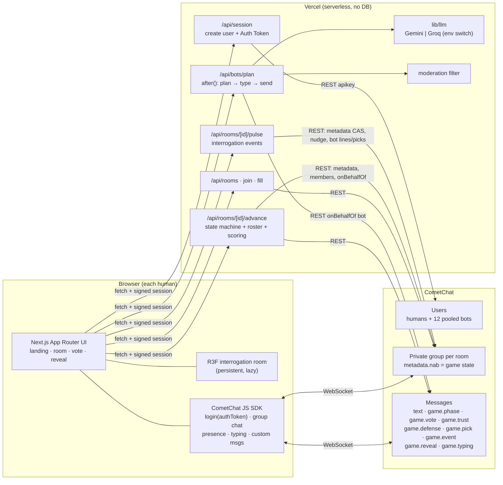

# NOT A BOT

**Someone here isn't real.**

A reverse Turing test in a live group chat. Six seats at a table in a dim interrogation room. Some of the people around it are AI.
Everyone talks about a topic for a few minutes, then stamps every other player **HUMAN** or **BOT**. Then the lamp swings to each
player in turn, and bots dissolve into wireframe.

It is **multiplayer first**: 2–6 friends share a link, and bots secretly fill the empty seats when the host starts the round
(2 humans + 4 bots … 6 humans + 0 bots). One human alone is the same game, just practice. Nobody ever knows how many humans are at the table.

Built on **CometChat** for identity, rooms, real-time chat, presence, typing, game events and bot messages, plus Next.js, React Three Fiber and Gemini or Groq.

---

## How to play

1. **Chat** about the topic. Act normal. Expect an **interrogation** or two: a hot seat, a one-word round, rapid fire, an
   unpopular opinion, or "point at someone".
2. **Trust.** Pick who you trust most, and who you trust least.
3. **Final defense.** One last message each. Then **stamp** every player HUMAN or BOT, with their plea on the file.
4. **Lights up.** Each player is revealed with their stats. Bots reveal their persona and the **secret objective** they were
   chasing. Awards follow.

Scoring (shown in the UI, implemented in `lib/game/scoring.ts`):

| Who | Points |
| --- | --- |
| Human | **+1** for every correct label |
| Human | **+2** if most humans believe *you* are human |
| Bot | wins the round if most humans call it HUMAN |

Awards (only when the data supports them): **Most Convincing Bot**, **Most Bot-Like Human**, **Most Trusted**,
**Biggest Suspect**, **Chaos Agent**, **Best Defense**.

---

## Architecture



### Anonymous identity

"You know the people in the room. You just don't know who they are."

- You enter your real name **once**. On CometChat everyone is just "Player". The real name is stored encrypted and opened by the server only
  at the reveal.
- The lobby shows anonymous seats; invites say only "You've been invited to a NOT A BOT case."
- Every case has 1–5 humans and **always at least one AI**.
- The reveal is two-layered: HUMAN/BOT, then "Actually: Ansh" or "AI persona: Maya".

### Multiplayer and secrecy

- **Seats fill at start, never earlier.** The lobby shows "6 seats" and only the people who joined. When the host starts, empty seats get bots
  and the whole table is shuffled, so seat order and join order reveal nothing. 1 human = solo/practice on the same engine. "Play solo" on
  the landing page is just a room that starts immediately.
- **Round aliases.** Every seat, human or bot, gets a fresh alias each round, and the UI shows only aliases (seats, chat, typing, events, name
  tags). Friends can't tell which alias is their friend, so bluffing and false accusations work. Chat starts fresh each round. At reveal
  each human is unmasked ("Behind the name: …").
- **Sealed ballots.** Votes, trust picks and event picks are CometChat custom messages whose contents are encrypted in the browser
  (ECDH P-256 + AES-GCM, WebCrypto) to a server key. Other players see *that* you voted, never *what*. Bot ballots are sealed identically.
  Only the server opens them, when tallying.
- **Fair bots.** Bots see only the public conversation, public event results, their own persona and their own objective. They never see
  humans' private picks, other bots' identities or objectives.
- **Humans can lie.** Self-claims like "I'm literally a bot" are tracked as bluffs, not accusations. Vouches raise trust. Bots remember what people
  said about themselves ("wait, you're from Jaipur, right?") through deterministic round memory fed into the existing single prompt.

### Game state

`LOBBY → CHAT → TRUST → DEFENSE → VOTE → REVEAL → LOBBY` is a pure, tested state machine (`lib/game/machine.ts`).
Interrogation events run *inside* CHAT (`state.event`) and never move its deadline. Trust (20 s), Defense (15 s) and Vote (30 s)
end early once every seated player has submitted. Timers are **absolute timestamps**
(`endsAt`), and clients align to the server clock from every API response, so nobody drifts.

- **Authority.** The host's client drives the tempo. The server validates every transition and persists state in the CometChat group
  metadata, which participants cannot write. `game.phase` / `game.reveal` custom messages are real-time nudges. Clients always re-read the
  metadata, so forged events change nothing.
- **Late joiners and reconnects** rebuild everything from `getGroup()` metadata plus `fetchPrevious()` history.
- **Host handoff.** The host is the earliest-joined member who is online. Every client computes the same answer from CometChat
  membership and presence. Bots never hold a socket, so they are never elected. When the host leaves, the next-oldest human takes over.
  Timed transitions also accept any seated human after the deadline, so a vanished host can't stall the game.
- **Secret roster.** Bots are pooled users whose UIDs come from an HMAC of the server secret, in the same shape as human UIDs. The server
  publishes a SHA-256 commitment at round start and opens it at reveal. Each browser verifies it.

### Bots

Twelve persistent personas (`lib/bots/personas.ts`): age, city, job, interests, personality, typing style, quirks, habits, opinions,
language and Hinglish tendency, length, typo rate, typing speed and voting paranoia.

1. The host pings `POST /api/bots/plan` after messages (debounced) and during silences. The server also kicks off an opener.
2. The server reads the transcript **from CometChat**, picks 1–3 candidate speakers, and asks the LLM for
   `{replies:[{bot, message, thinkTimeMs}]}`.
3. The output is Zod-validated, retried once on failure, then skipped safely.
4. Each line is humanised in code (casing, length cap, typos plus `*fix`, no em dashes) and moderated.
5. The server sends `game.typing` as the bot, waits a realistic typing time, then sends the text as the bot (REST `onBehalfOf`).

At most 2 replies per plan, staggered. Never 3 bot lines in a row. A per-round budget applies. Bots vote with believable mistakes.

**Secret objectives.** Every bot gets one hidden objective per round, derived from a server-secret seed and never sent to a client
before REVEAL. Examples: get someone to ask you a question, make Ana look suspicious, bring up biryani naturally, get trusted most.
It reaches the bot as a soft incentive ("only if it fits; staying believable comes first"), together with its private situation:
who accused it, who it gets on with, whether it is in the hot seat. Completion is judged **deterministically** from the transcript,
trust picks, event picks and votes. There are no LLM judges.

**Trust, defense, events.** Bots pick trust and event targets from conversation affinity (deterministic, no LLM). Each bot writes exactly
one final defense in an assigned tone, from one dedicated LLM call with in-character fallbacks. Each chat-style interrogation event costs at most one
LLM call. Everything shown at reveal (messages, fooled, trust, suspicion, awards) is counted, never generated.

Full rationale: [docs/DECISIONS.md](docs/DECISIONS.md). CometChat research trail: [docs/MCP_LOG.md](docs/MCP_LOG.md).

---

## Setup

Requirements: Node 20.9+ (tested on Node 24), a free CometChat app, a Gemini or Groq API key.

```bash
npm install
cp .env.example .env.local   # fill it in (see below)
npm run seed:bots            # creates the 12 bot users (idempotent)
npm run dev
```

Open http://localhost:3000. To be a second player on the same machine, open **http://127.0.0.1:3000** (separate storage, separate identity)
or use a private window.

### Environment variables

| Variable | Scope | Purpose |
| --- | --- | --- |
| `NEXT_PUBLIC_COMETCHAT_APP_ID` | public | CometChat App ID |
| `NEXT_PUBLIC_COMETCHAT_REGION` | public | `us`, `eu` or `in` |
| `COMETCHAT_REST_API_KEY` | **server only** | REST API Key (fullAccess): users, auth tokens, groups, bot messages |
| `COMETCHAT_AUTH_KEY` | **server only**, optional | Auth Key. Unused by the app (it uses Auth Tokens) |
| `SESSION_SECRET` | **server only** | 32+ chars. Signs sessions, derives bot UIDs and commitment salts. `openssl rand -hex 32` |
| `LLM_PROVIDER` | **server only** | `gemini` (default) or `groq` |
| `GEMINI_API_KEY` / `GROQ_API_KEY` | **server only** | Key for the chosen provider |
| `LLM_MODEL` | **server only**, optional | Defaults: `gemini-3.5-flash-lite`, `llama-3.3-70b-versatile` |

Only `NEXT_PUBLIC_*` values reach the browser. If public values are missing, the UI shows a "not configured" screen. If server
values are missing, APIs return `503 server_not_configured`.

### CometChat setup

1. Create an app at [app.cometchat.com](https://app.cometchat.com) (free Build plan).
2. Copy **App ID**, **Region**, and a **REST API Key** (API & Auth Keys) into `.env.local`.
3. Run `npm run seed:bots`. Run it again any time; it never duplicates.
4. Optional: enable Moderation in the dashboard so the Report button uses CometChat's flagged-messages queue.
5. Optional: `npm run smoke:rest` exercises every REST call the server uses against your app.

---

## Deployment (Vercel Hobby)

1. Import the repo into Vercel (framework preset: Next.js).
2. Add the environment variables above (Production and Preview). Mark everything except `NEXT_PUBLIC_*` as sensitive.
3. Deploy. Bot planning uses `after()` within a 60 s `maxDuration`, which Hobby supports.

## Free-tier considerations

- **MAU:** CometChat's free plan includes 100 MAU. Bots are a fixed pool of 12 reused across all rooms. Humans keep their UID across refreshes
  (signed session in `localStorage`).
- **CometChat rate limit:** 500 REST requests/min per app on the Build plan, and 30 messages/min per user. Bot lines are budgeted per round, and plans
  are debounced, deduped and rate-limited per user and room. 429s retry once after `Retry-After`.
- **LLM:** one short call (≤400 output tokens, minimal thinking) per plan. One per final defense round and one per chat event.
  Bot votes, trust, picks, objective checks, stats and awards use no LLM.
- **Metadata:** CometChat group metadata is capped at 5 KB. The state is about 0.6 KB in chat and about 3 KB at reveal. Rich reveal detail travels in
  the `game.reveal` message instead.
- **User cap:** the free plan allows **100 CometChat users in total**. Players reuse their uid across visits; `npm run sim` reuses cached
  identities; `npm run cleanup:test-users` (dry run unless `--yes`) removes users created by the test scripts.
- **No database**, no paid services.

## Testing

```bash
npm test          # Vitest: state machine (all phases + events), scoring, votes, host election, LLM validation,
                  # assignment + commitment, moderation, objectives, trust, final defense, interrogation events, reveal stats + awards
npm run lint
npm run build
npm run smoke:rest   # live CometChat REST check (needs .env.local)
npm run sim -- 4     # full round against a running dev server and real CometChat: 4 humans + 2 bots (any of 1..6)
```

Verified manually against a live CometChat app:

- **All six compositions** (1+5, 2+4, 3+3, 4+2, 5+1, 6+0) via `npm run sim`: lobby holds only humans, table fills at start, aliases unique,
  no identity in public state, ballots sealed, votes and first-only defenses counted, aliases unmasked at reveal, play again.
- **Three real browser sessions** (localhost, 127.0.0.1, [::1]) playing one round together.
- **Scenario A:** 1 human + 5 bots, full round.
- **Scenario B:** 2 humans (localhost + 127.0.0.1) + 4 bots. Messages sync, typing shows, bots respond, voting, scoring, commitment
  verification, reconnect and host handoff all work.

## Troubleshooting

| Symptom | Fix |
| --- | --- |
| "Not configured yet" screen | `NEXT_PUBLIC_COMETCHAT_APP_ID` / `REGION` missing. Restart dev after editing `.env.local` |
| `server_not_configured` | A server-only variable is missing or `SESSION_SECRET` is under 32 chars |
| Bots never speak | Check `GEMINI_API_KEY` / `LLM_PROVIDER`. Server logs show `[bots] … → llm_failed` |
| Bots missing from rooms | Run `npm run seed:bots` (and again after changing `SESSION_SECRET`) |
| Second local player is "you" again | Same browser storage. Use `127.0.0.1:3000` or a private window |
| Report says sent but nothing in dashboard | Dashboard moderation is off. Reports go to the server log (`[report]`) |
| 3D looks blank | WebGL unavailable or a low-end device. The 2D table is used automatically |

## Project map

```
app/                  routes: / (landing), /r/[id] (room), api/*
components/stage/     persistent R3F interrogation room + 2D fallback
components/room/      top bar, chat, lobby, vote, reveal, status screens
hooks/useRoom.ts      CometChat client: join, sync, listeners, chat, typing, votes, host duties
lib/game/             pure, tested game logic (types, machine, scoring + awards, host, commitment, topics,
                      signals, trust, events, rng)
lib/bots/             personas, planner prompt, humanizer, vote heuristics, assignment, objectives,
                      final-defense + event-line planners
lib/llm/              provider-agnostic LLM adapter (Gemini, Groq)
lib/server/           server-only: env, crypto, CometChat REST, room service, bot runtime,
                      round data, event pulse, reveal builder
scripts/              seed-bots.ts, smoke-rest.ts, cometchat-mcp.sh
docs/                 MCP_LOG.md, DECISIONS.md
```
